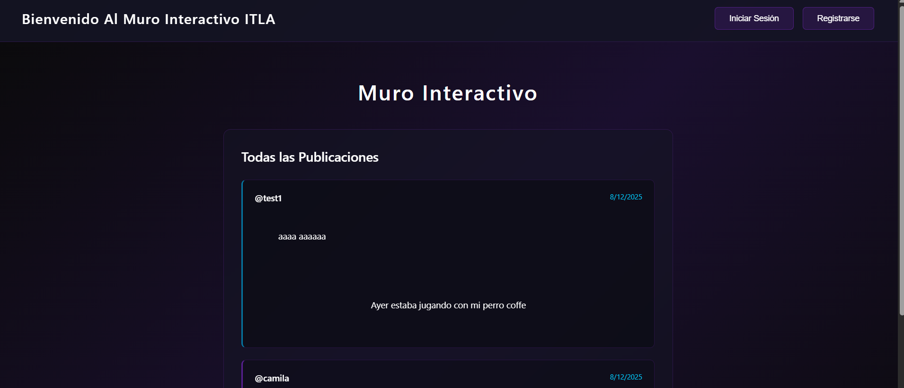
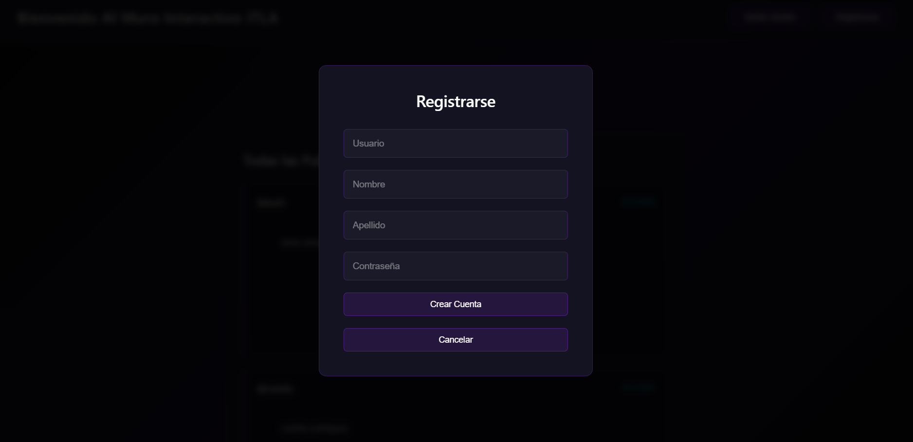

## Proyecto final

Este es el proyecto final de la asignatura de programacion web, donde escogi la opcion de Muro Interactivo, las cuales tiene las siguientes funcinalidades

1. Ver todas las publicaciones hechas por todos los usuarios (No requiere autenticación)
2. Crear una cuenta de usuario (del usuario se guardará: usuario, clave nombre, apellido)
3. Iniciar Sesión
4. Publicar nuevos posts (Solo usuarios autenticados)

Rafael Enmanuel Rodriguez Acevedo
2024-1756